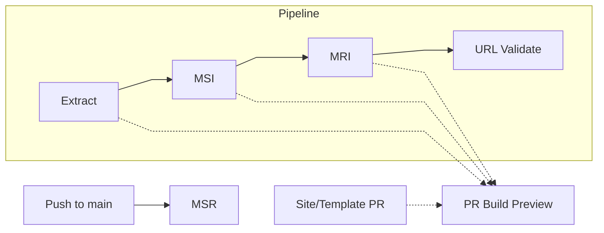

# MSRBot.io
Automated cross-publisher standards index 
_built and maintained by [Steve LLamb](https://github.com/SteveLLamb)_

[](https://github.com/PrZ3r/MSRBot.io/actions/workflows/extract-docs-smpte.yml)
[](https://github.com/PrZ3r/MSRBot.io/actions/workflows/extract-docs-ietf.yml)

[](https://github.com/PrZ3r/MSRBot.io/actions/workflows/build-master-reference-index.yml)
[](https://github.com/PrZ3r/MSRBot.io/actions/workflows/build-master-suite-index.yml)

[](https://github.com/SteveLLamb/MSRBot.io/actions/workflows/pr-build-preview.yml)

[](https://github.com/PrZ3r/MSRBot.io/actions/workflows/build-msr-site.yml)
[](https://github.com/PrZ3r/MSRBot.io/actions/workflows/validate-urls.yml)


## Why It Exists
[MSRBot.io](https://msrbot.io/) is a live, automated (and hand curated) Media Standards Registry (MSR) of media technology documents — extracting, validating, and linking documents across [SMPTE](https://www.smpte.org/), [ISO](https://www.iso.org/home.html), [ITU](https://www.itu.int/), [AES](https://aes2.org/) and other many other publishers, SDOs, and industry groups. 

MSRBot.io began in 2020 as a response to a long-standing gap in how the media and entertainment industry tracks its own standards, best practices, specifications, and other important documents and publications - and the references contained within. Understanding the tangled tree branches and roots of documents' dependencies due to the nature of nested references (sometimes circular, and often cross-org), was required for regular maintanance of these critically important documents. 

Documents from [SMPTE](https://www.smpte.org/), [ISO](https://www.iso.org/home.html), [ITU](https://www.itu.int/), [AES](https://aes2.org/) and others have always been interconnected — yet their references lived scattered across the internet as generated or scanned PDFs, HTML pages, TXT files, sometimes hidden behind paywalls, or trapped in inconsistent formats. MSRBot.io was built to solve that: an open, automated registry that maps those relationships, extracts structured metadata, and preserves a living history of the standards ecosystem. 

What started as a personal tool to make sense of reference trees has grown into a self-maintaining system that reveals the lineage, dependencies, and context of the world’s media technology documents

> See [docs/buildlog.md](docs/buildlog.md) for details of [v1.0.0](https://github.com/PrZ3r/MSRBot.io/releases/tag/v1.0.0) released on Nov 26, 2025.

### Live Stats

[](https://msrbot.io/api/viewer.html?path=documents.total)
[](https://msrbot.io/api/viewer.html?path=suites.total)
[](https://msrbot.io/api/viewer.html?path=documents.active)
[](https://msrbot.io/api/viewer.html?path=documents.docTypes)
[](https://msrbot.io/api/viewer.html?path=documents.references)
[](https://msrbot.io/api/viewer.html?path=documents.publishers)

> _All badges are generated from live JSON at [api/stats.json](https://msrbot.io/api/stats.json)._

#### Details
- **Published historical range:** 1896 → present  
- **Automation uptime:** 100% since August 2025 (SMPTE)
- **Publishers covered:** SMPTE, NIST, ISO, ITU, AES, and more

### Key Artifacts
- Core data stored as JSON: [`src/main/data`](src/main/data/)
- Schema for data: [`src/main/schemas`](src/main/schemas/)
- Main document Dataset: [`documents.json`](src/main/data/documents.json)
- Document lineages: [Master Suite Index (MSI)](src/main/reports/masterSuiteIndex.json)
- Document reference maps: [Master Reference Index (MRI)](src/main/reports/masterReferenceIndex.json)
- Live API Stats: [api/stats.json](https://msrbot.io/api/stats.json)
- Public Site generated from `main` at <https://msrbot.io>
- Change Log: [CHANGELOG.md](CHANGELOG.md)

## Portals

**Portals** are curated, topic-oriented landing pages that aggregate related documents, resources, and explanatory context across publishers, suites, collections, and document types.

Unlike Suites or Collections, which are derived directly from publication structure and numbering, Portals are intentionally editorial. They are designed to provide practical entry points into complex subject areas (such as Digital Cinema, IMF, or Accessibility) without requiring prior knowledge of specific standards bodies or document identifiers.

Each Portal may include:
- A narrative overview and background context.
- A curated, non-exhaustive list of relevant documents resolved to their latest applicable versions.
- Cross-publisher coverage (e.g., SMPTE, ISO, ITU, AES).
- Structured resource links (organizations, tools, references).
- Search, filtering, and sorting consistent with Suites and Collections.

Portals are rendered as first-class pages with stable URLs (e.g. `/dcinema/`) and are intended to complement — not replace — authoritative publisher documentation.

### Suites, Collections, and Portals

MSRBot.io organizes documents using three complementary concepts, each serving a distinct purpose:

| Concept | Primary Basis | Scope | Purpose |
|-------|---------------|-------|---------|
| **Suites** | Formal multipart standards (shared lineage / numbering) | Single publisher | Represent authoritative multipart standards and their evolution over time |
| **Collections** | Related documents grouped by title or theme | Single publisher | Group related documents that are not formally multipart |
| **Portals** | Curated topic areas | Cross-publisher | Provide navigable, contextual entry points across standards ecosystems |

Suites and Collections are derived directly from publisher-defined structures and identifiers. Portals, by contrast, are curated to support discovery, orientation, and cross-domain understanding, particularly in areas where relevant documents span multiple organizations and formats.

## Automation Overview
MSRBot.io updates itself through a chain of automated GitHub Actions. When appropriate, PRs generate MSR Build Preview review links. 

> See [`docs/samples.md`](docs/samples.md) for full workflow details and live run sample links.

| Stage | Purpose | Trigger | Key Output |
|:------|:---------|:---------|:------------|
| Extract | Pulls and parses provider metadata (SMPTE/IETF) | Scheduled + Manual | `documents.json` |
| MSI | Builds document lineages | PR merge to `main` / Manual | `masterSuiteIndex.json` |
| MRI | Maps references across all docs | After MSI | `masterReferenceIndex.json` |
| MSR | Builds and publishes the site | Push to `main` / Manual | <https://msrbot.io/> |
| URL Validate | Checks and normalizes links | After MRI / Weekly (Sat) | `url_validate_audit.json` |
| PR Build Preview| Builds MSR preview prior to publication | PR updates + upstream workflow runs | <https://msrbot.io/pr/###/> |


_Dotted lines indicate PR-triggered preview builds. Extract, MSI, MRI, and site/template PRs all generate a preview._

### Weekly Schedule (UTC)
| Day | Time (UTC) | Pacific (PST) | Workflow |
|:--|:--|:--|:--|
| Monday | 04:15 | Sunday 20:15 | `Extract Documents - SMPTE` |
| Tuesday | 04:45 | Monday 20:45 | `Extract Documents - IETF` |
| Saturday | 04:15 | Friday 20:15 | `Validate Document URLs` |
| Sunday | 09:00 | Sunday 01:00 | `PR Preview Sweeper` |
| Sunday | 09:30 | Sunday 01:30 | `Branch Sweeper` |

_PST shown above (UTC-8). During daylight saving (PDT, UTC-7), add 1 hour._

Event-driven workflows run on upstream completion or repository events:
- `Build MSRBot.io Site and Test` (`push` to `main`)
- `Build MasterSuite Index` (PR merge to `main`)
- `Build MasterReference Index` (after MSI)
- `Validate Document URLs` (after MRI)
- `PR Build Preview (MSRBot.io site)` (`pull_request` and extract/MSI/MRI/URL Validate workflow runs)

### Development
Requires Node 20 + npm.  
Run scripts with:
```bash
npm run extract
npm run extract-smpte
npm run extract-ietf
npm run build-msi
npm run build-mri
npm run validate-url
npm run normalize-url
npm run canonicalize
npm run validate
npm run validate -- --warn
npm run docs-sort
npm run docs-validate
npm run docs-fix
npm run keywords-sync
npm run keywords-sync -- --write
npm run build
```
Quick reference:
- `extract` / `extract-smpte`: run SMPTE document extraction.
- `extract-ietf`: run IETF document extraction.
- `build-msi`: build Master Suite Index (lineages/suites metadata).
- `build-mri`: build Master Reference Index (cross-doc reference map).
- `validate`: schema + registry validation (`--warn` for keyword warn-only mode).
- `docs-sort`: sort `documents.json` by `docId` (validator-compatible order).
- `docs-validate`: run document validation flow.
- `docs-fix`: run `docs-sort` then `docs-validate`.
- `validate-url`: run URL reachability/audit checks.
- `normalize-url`: apply URL normalization/backfill from URL audit.
- `canonicalize`: normalize/sort registry JSON output format.
- `keywords-sync`: detect (or `--write` append) controlled keyword updates.
- `build-index`: build search index artifacts.
- `build-stats`: build API/site stats artifact.
- `build`: build full static site output.
- `audit`: generate document audit report.

For the full command and flag reference (including `build-mri`, `build-msi`, `audit`, `validate-url`, and runtime env vars), see [`docs/commands.md`](docs/commands.md).

#### Extraction Scripts and Providers
- `npm run extract`: convenience alias for SMPTE extraction (currently equivalent to `extract-smpte`).
- `npm run extract-smpte`: explicit SMPTE extraction.
- `npm run extract-ietf`: explicit IETF extraction.
- Under the hood, extraction now requires an explicit provider flag:
  - `node src/main/scripts/extractDocs.js --provider smpte`
  - `node src/main/scripts/extractDocs.js --provider ietf`
- If additional providers are added, use explicit scripts per provider (recommended naming: hyphen style, e.g. `extract-iso`, `extract-itu`) and keep workflow calls aligned to those script names.

#### Reference Resolution and MRI
- Shared reference parsing/resolution lives in `src/main/lib/referencing.js` and is reused across providers.
- `badRefs` reports only citations that cannot be parsed into a canonical `docId`.
- Parseable refs that are not yet present as source documents are tracked in MRI with unresolved presence state (`sourcePresent: false`) and should be backfilled via data updates or targeted `refMap` rules.
- Prefer href-based normalization rules in `parseRefId` for stable web patterns (for example, Unicode versions, Bugzilla issue links) and use `src/main/input/refMap.json` for curated/manual edge mappings.

#### Keyword Governance
- Source of truth for allowed keywords is `src/main/config/site.json` under `controlledKeywords`.
- `src/main/schemas/documents.schema.json` intentionally does not enforce a hard keyword enum.
- Keyword conformance is validated in `src/main/scripts/documents.validate.js` during `npm run validate`.
- Ingested IETF keywords are normalized to project style (Title Case with preserved acronyms/common forms such as `JSON`, `URN`, `B-Chain`, `DCinema`, `DCP*`, `SHA-1`).
- Validation mode can be selected at runtime:
  - Strict (default): `npm run validate` or `npm run validate -- --error`
  - Warn-only for unknown keywords: `npm run validate -- --warn`
- Extract workflows (`extract-docs-smpte.yml`, `extract-docs-ietf.yml`) run validation in warn mode for unknown keywords (`KEYWORD_VALIDATION_MODE=warn`), while build/local defaults remain strict unless overridden.
- Use keyword sync to review and optionally add new observed keywords:
  - Dry run: `npm run keywords-sync`
  - Write updates to `site.json`: `npm run keywords-sync -- --write`
---
### Contributing
Issues and pull requests are welcome.  
For questions or collaboration inquiries, contact [Steve LLamb](https://github.com/SteveLLamb).

---

### Data Disclaimer
[MSRBot.io](https://msrbot.io) aggregates factual metadata and references
via [https://github.com/PrZ3r/MSRBot.io/](https://github.com/PrZ3r/MSRBot.io/) about publicly released standards, best practices, and other documents (e.g., [SMPTE](https://www.smpte.org/), [ISO](https://www.iso.org/home.html), [ITU](https://www.itu.int/), [AES](https://aes2.org/), and many others).

All metadata is derived from publicly available information and is provided
for research and interoperability purposes only. Original standards and other documents remain the intellectual property and copyright of their respective publishers, as applicable.
